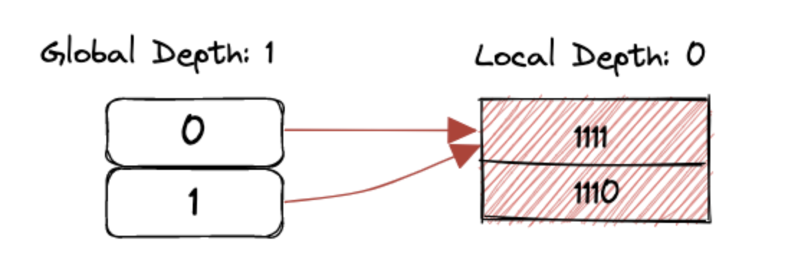
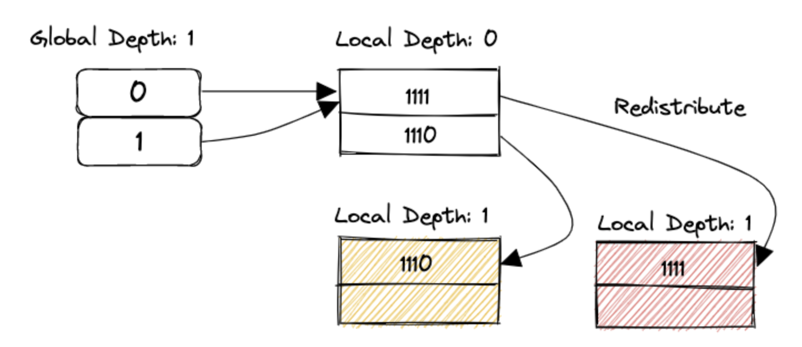
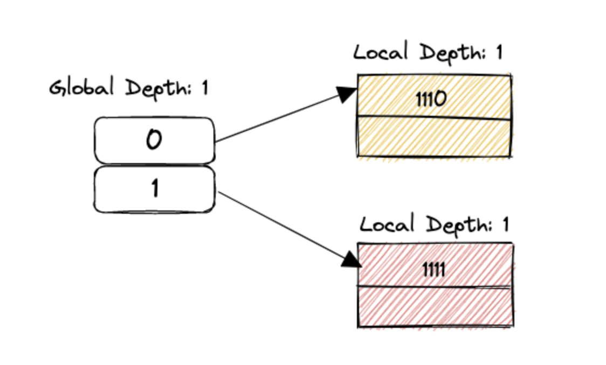
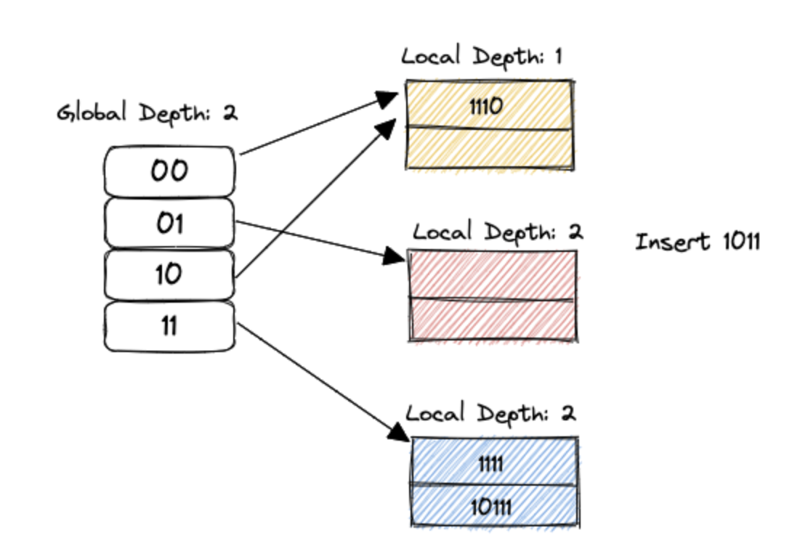
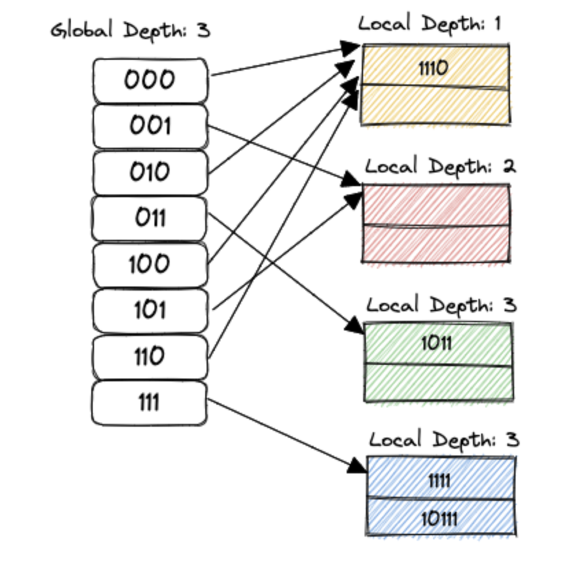

这个 Lab 做起来成就感是最足的，首先修改 `RemoveTest1` 的各项指标拉满 (上限为 9, 9, 511), 然后把 `num_keys` 改为 10W，然后把这个测试过了就满分了～（唯一一个阴间的测试本文最后给了提示～）善用 GDB, BUSTUB_ASSERT, 个人觉得是非常合格的 debug + modern cpp exercise.

### **Read/Write Page Guards**

首先完成使用 RAII 管理 Page. RAII 要求提供移动构造和赋值函数，因此需要 Flag 标识资源是否有效。先要弄清楚资源如何获取和释放：`FetchPage()` `UnpinPage()` .

我们还要额外包装读写 Page（需要对 Page 元数据中的 Latch 分别上读锁和写锁），还要额外登记 Page 的 `dirty` 情况。比如 PageGuard 的移动赋值函数：

```C++
auto BasicPageGuard::operator=(BasicPageGuard &&that) noexcept -> BasicPageGuard & {
  if (this == &that) { // 赋值函数需要判断自我赋值的情况
    return *this;
  }
	// Unpin page + reset to nullptr
  this->Drop();
  this->bpm_ = that.bpm_;
  this->page_ = that.page_;
  this->is_dirty_ = that.is_dirty_;
	// reset to nullptr, 如果Page *是空指针，说明资源无效
  that.Reset();
  return *this; // 返回this是为了连续赋值～
}
```
同理，Update 到 WPage & RPage 也是转移资源所有者并且拿锁。Bustub 为 WPage & RPage 提供了一套 As, 可以将读取到内存的字节流转换为 C++的内部数据结构：
```C++
  template <class T>
  auto As() -> const T * { // 将Page的首地址强制转换为目标类型
    return reinterpret_cast<const T *>(GetData());
  }
  auto GetDataMut() -> char * {
    is_dirty_ = true; // 一旦要求可写内存块，必须假定is_dirty为true
    return page_->GetData();
  }
  template <class T>
  auto AsMut() -> T * {
    return reinterpret_cast<T *>(GetDataMut());
  }
```

思考一下现在发生了什么：我们实现了一个管理所有内存页的 Buffer Pool Manager, 每个 `buffer_page` 后面都有一个磁盘页作持久化，可以通过新建一个内存页的方式新分配一个磁盘页，也可以通过 `page_id` 从磁盘读取页存在内存中。

通过 `fetch()` 从磁盘中读取页，通过 `unpin()` 释放页。然后我们对页这个资源实现了 RAII 的管理，可以管理其是否脏，管理页面的读取，写回，还能将内存页的 4K 转换成 C++内结构化的 Class.

接下来要实现的就是把这些页组织起来，类似页表的结构。有的页是一级的 `header`, 有的是二级的 `directory`, 有的是第三级的 `bucket`. 给定 Key 的哈希值，就可以找到 Key 所在的 `bucket`, 而且不像页表，要考虑哈希不平衡的问题（页表可以视为哈希完全固定且平衡的情况）。

### Extendible Hash Page

如上所述，这里页大小都是 4K. 分为 3 级：
![[./assets/Untitled 1.png|Untitled 1.png]]
**Header Page**:
首先需要弄清楚一个概念，物理上限和实际上限 (`max_depth`)。
对 header 来说，需要通过哈希值找到各个 directory 桶。这里的规则是将 most-significant 的 X 位作为索引。因此 header 中的 slot 为 2^X 个。Header 指向 `page_id` , 大小为 4B（也就是每个 Slot 占据 4B 空间）, 然后需要 4B 记录 X, 因此，X 最大为 9, 此时一共占据 512 * 4 + 4 = 2052 Bytes. 512 就是物理上限。

但是实际上，我们可以将 X 设置为小于等于 9 的任何数字，这是实际上限。
Header 没有 Extend 和 Shrink 的需求，所以是很好写的。最主要就是如何根据哈希值计算出对应的 Slot:

```C++
auto ExtendibleHTableHeaderPage::HashToDirectoryIndex(uint32_t hash) const -> uint32_t {
  return (hash >> (32 - max_depth_)) & ((1 << max_depth_) - 1);
}
```
注意，在初始化的时候，所有的 slot 都要设置为 `INVALID_PAGE_ID`.

**Directory Page:**

Directory Page 假设 global depth 为 Y, 那么就有 2^Y 个 Slot, 每个 Slot 都都有自己的 local depth Z, Z <= Y.

在查找的时候，取哈希值的 `least-significant` 的 Y 位作为索引，找到这个 Slot 里面的 `page_id`, 就可以找到 `bucket_page` 了。举个例子：假设 `header_page` 的 `max_depth` 若为 3, `global_depth` 为 2. 对于 001….. 01 而言，会取 `header_page` 的第 2 个 Page, 然后取 `directory_page` 的第二个 Slot 对应的 `bucket_page`.

那 local_depth 有什么作用呢？这是一个优化。在 `global_depth` 为 7 的情况下，我们不一定需要 2^7 个 `bucket_page` . 举个例子 (ref [source](https://blog.csdn.net/MelroseLbt/article/details/129329316))：

按顺序插入 15，14，23，11，9, 也就是 1111, 1110, 10111, 1011, 1001. 一开始 global depth 为 0, bucket size 为 2. 所有人取前 0 个数都是 0, 所以都落到第一个 slot.
 
插入 10111 的时候，发现满了，先扩容，那么需要 `++local_depth`, 发现超过了  `global_depth` . 所以先要进行全局扩容。由于每次 `++global_depth` 都会让 slot 数目翻倍，让 `added_index`  和  `added_index ^ (1 << global_depth)` 保持一致：



这时候可以 `++local_depth[0]`  啦。这需要分配一个新的 bucket page. 是的，`++global_depth` 要做的是 double slot 然后把新的 slot 指向的 bucket 设置为他们的兄弟。而只有 `++local_depth` 才会真的分配一个新的 bucket_page.



 然后把满的 bucket page 按照新的映射规则分开。



重新计算 `IndexOf(key)`，由于改变了 global depth, 10111 应该被插入到下面的 slot. 

然后插入 `1011`, 居然又是下面那个，那么需要 `++local_depth`, 发现 global_depth 到天花板了，所以要重复上面的过程：



现在，如果插入 100 和 1100 两个数字，那么上面的 bucket page split 就不需要扩大 Global depth 了，只需要新分配一个 bucket page  然后重新把各个 key 分配到新的 page 即可。

实际映射的 `bucket_page` 取决于 `local_depth`.

对于最大深度， `max_depth` 为 9. 对每个 `slot`, 需要 4B 保存 `page_id` 以及 1B 保存 `local_depth`. 还需要 8B 的 `metadata`. 一共占据 5 * 512 + 8 = 2568B.

这里最复杂的我认为是如何找到「同簇同族」的一系列 slot. 比如图中：



000, 010, 100, 110 都指向同一个 page. 也有 001, 101 这样两个指向一个 page 的。怎么办呢？`local_depth` 的真实意义其实是，「只要多少个 least-significant bits 就足够找到这个了」。所以，对于 local_depth 为 1 的，我们知道 100, 那么只要 100 & (1 << 1) 就可以知道这个簇的「start」了，然后每个「step」的长度是 (1 << 1), 这样就可以完成遍历。

读者可以思考，一个 Bucket Page 被几个 slot 指着？

答案是 `2 ^ (global_depth - local_depth)`, 最低的 `LOCAL` 位已经确定一样，这一批 slot 指向同样的一个 `bucket_page` , 剩下还有 `global_depth - local_depth` 自由排列。

**Bucket Page:**

Bucket Page 没有深度的概念了。我们存储 `size`, `max_size` 之后，剩下的都可以存储我们的数据。最多可以存 4096 - 4 - 4 = 4088 Bytes 的数据。（也不需要是 2 的幂）

对于 Bustub, 我们存的是 Key→RID 的映射，RID 由 Page ID + Slot ID 组成，大小为 8 Bytes. 在 Bucket page 中，由于我们没有任何的索引和顺序，所以插入的时候从后面插入，查找的时候逐个查找即可。

Insert 的时候直接插入到最后，Remove 的时候将队尾的元素 `std::move()` 到被移除的 slot, `size—` . Lookup 的时候则需要遍历一次。

### Extendible Hash Table

首先要利用之前的 `WritePageGuard` & `ReadPageGuard`, 比如一开始如何初始化唯一的 header_page: (这个 header page 号是唯一要保存的，这也是为什么我们要增加一层 header)
```C++
BasicPageGuard header_page_guard = bpm->NewPageGuarded (&header_page_id_);
auto header = header_page_guard. AsMut<ExtendibleHTableHeaderPage>();
header->Init (header_max_depth);
```

#### GetValue

如果找到了，将结果 `emplace_back` 到 `result`, 否则返回 `false`. 剩下的都是对之前 Page 函数的调用，包括哈希 Mask, GetBucketPageId, Lookup 等。比如如何从 header_page 搞到 directory_page:

```c++
if (auto directory_page_id = header_page->GetDirectoryPageId(header_page->HashToDirectoryIndex(hash)); directory_page_id != INVALID_PAGE_ID) {
    auto directory_guard = bpm_->FetchPageRead(directory_page_id);
    auto directory_page = directory_guard.template As<ExtendibleHTableDirectoryPage>();
	// ...
}
```

这个要加 template 关键字的 As 函数是因为：

> When the name of a member template specialization appears after . Or -> in a postfix-expression, or after nested-name-specifier in a qualified-id, and the postfix-expression or qualified-id explicitly depends on a template-parameter (14.6.2), the member template name must be prefixed by the keyword template. **Otherwise the name is assumed to name a non-template**.


#### Insert

这里抽出了 `InsertToNewDirectory` 和 `InsertToNewBucket` 两个函数，因为 `NewDir` 必然导致调用 `NewBucket` , 内部的逻辑大致为：
```C++
Auto new_directory_page_guard = bpm_->NewPageGuarded (&new_directory_page_id);
If (new_directory_page_id == INVALID_PAGE_ID) { return false; }
auto new_directory_page = new_directory_page_guard. Template AsMut<ExtendibleHTableDirectoryPage>();
// Init 后将上层的 header_page 指向的页面设置为新的 page_id
New_directory_page->Init (directory_max_depth_);
Header->SetDirectoryPageId (directory_idx, new_directory_page_id);
```

对于 Bucket 不存在也是如此，先分配新的 Page, 设置上层页面的逻辑，然后初始化页面。
在 DirectoryPage 或者 BucketPage 都存在，逻辑如下：

- 如果 Key 已经存在，返回 Fasle
- 如果 `bucket_page` 已经满了，`while (bucket_page->IsFull())` 然后
    - 如果 directory_page local_depth 超过 max_depth, 说明 hash table 已满，返回 False 即可
    - `IncrLocal` 如果出现超过 `global_depth`, 那么做 ++ 然后让后半段 slots 指向前半段 slots 指向的 pages, 再 `IncrLocal`.
    -  然后我们有了一个新的 bucket page 是吧，用新的 local_depth 来做 mask 确定原来的 bucket page 哪些需要搬家过去
    - 然后，用我们上面的 start & step, 遍历这个簇的每一个 slot，计算他们应该指向哪个 bucket page
- 直到不 Full 为止（有可能根本没有搬家过去的硬骨头...），然后插入

#### Remove

这里还有个 Shrink. 也就是在正常的 GetValue 逻辑之后如果 bucket_page 是 empty 的，那么尝试一下合并。（其实这是比较保守的合并策略，但是好就好在避免大量的 Split.）

首先，要得到「一定指着另一个 bucket page 的兄弟 slot」。如果合并成功，是不是会 `local_depth -= 1`? 比如 00011 的 local depth 是 5，我希望和 10011 的一整个簇合并，所以：`bucket_idx ^ (1 << (local_depths_[bucket_idx] - 1))`

找到一整个簇之后，我们需要保证两者的 local depth 一致。想想我们的找一整个簇的方法？Step 如果不一致，是无法合并的。假设都一样，那么我们先 Drop 掉对空页的资源，`bpm_->DeletePage(bucket_page_id);` . 随后，我们需要减少 Local Depth, 重新映射这个 Slot 到被删除的簇，然后继续检查这个簇的兄弟是不是空的，判断需不需要递归的进行。

> 为什么兄弟可能是空的？
> 
> 我们上面提到，如果兄弟的 local depth 不一样，那么不能 shrink，所以可能在 shrink 的过程会发现兄弟是空的 bucket.

最后，如果所有的 local depth 都小于 global, 可以 shrink global 了。

然后我们把 BPM 的 size 开到最大，把 Hash table 的三个最大值拉满测试  Insert - Remove - Insert, 如果成功，就可以通过了。

除了...

**GrowShrinkTest**: BufferPool 容量为 3，这样当需要 Grow 的时候，必须要先释放掉 Header Page. 在拿到 `directory_page_id` 以后首先就要 Drop 掉 `header_page_guard`. 这个测试无敌了...